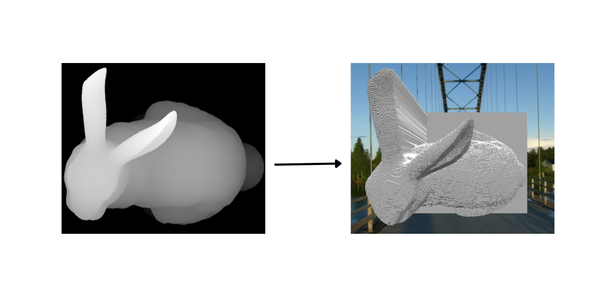

# Shaqran - Drone-Based Post-Crisis 3D Data Analysis

This repository contains the Shaqran project, a sophisticated solution designed for post-crisis analysis using drone-captured 3D data. The project leverages depth maps extracted from drone images to create detailed 3D models, which can be crucial for assessing damage and planning recovery efforts.

## Project Overview

The Shaqran project is focused on revolutionizing how post-crisis situations are analyzed. By using drones equipped with advanced imaging technology, we can capture high-resolution images that are then processed to extract depth information. This depth information is used to create 3D models of affected areas, providing critical insights for emergency response teams.

The process involves multiple steps:
1. **Data Collection:** Drones capture high-resolution HEIC or DNG images of the area.
2. **Depth Map Extraction:** The depth information is extracted from these images using FFmpeg for HEIC files or ExifTool for DNG files.
3. **3D Model Generation:** The extracted depth maps are processed in Python to create 3D models using the Trimesh library.
4. **Analysis and Visualization:** The 3D models are used for detailed analysis, helping emergency teams make informed decisions.

## Installation

### Prerequisites

- **FFmpeg:** Required for `heic_to_depth.py` and the Flask app to extract streams from HEIC files. Make sure to place the `ffmpeg.exe` file inside the Flask app folder.
- **ExifTool:** Required for extracting depth maps from DNG files. Ensure that `exiftool(-k).exe` is in the same directory as the Flask app.

### Flask App Setup

The Flask application included in this project provides a user interface to upload HEIC or DNG files and convert them into 3D models. The steps to set up the Flask app are as follows:

1. **Place FFmpeg and ExifTool in the Flask app folder.**
2. **Run the Flask app:**

   ```bash
   python app.py
   ```

### Python Requirements

Install the required Python packages using pip:

```bash
pip install -r requirements.txt
```
### Project Structure
1-**heic_to_depth.py**: Script to extract depth maps from HEIC files.

2-**flask_app/**: The main Flask application for handling file uploads, processing depth maps, and generating 3D models.

3-**static/**: Contains CSS, JavaScript, and images for the Flask app.
4-**templates/**: Contains the HTML templates for the Flask app.
5-**requirements.txt**: Lists all the Python packages required to run the project.
### Python Code
The main Python scripts for depth map extraction and 3D model generation are designed to be modular and efficient. Below is a high-level overview of the key functions:

1-extract_last_stream(heic_file, ffmpeg_executable, user_ip): Extracts the last stream (depth map) from a HEIC file using FFmpeg.
2-extract_depth_map_from_dng(dng_file, user_ip): Extracts the depth map from a DNG file using ExifTool and converts it to PNG.
3-process_depth_map(depth_map_path, user_ip): Processes the extracted depth map to generate a 3D model using Trimesh.
These functions are integrated into the Flask app to provide an easy-to-use interface for generating 3D models from drone images.

### Example Image
Below is an example of a depth map extracted from a drone-captured image:



### Conclusion
Shaqran is a powerful tool for post-crisis analysis, providing detailed 3D models that can aid in emergency response and recovery efforts. By leveraging the latest imaging technology and advanced Python libraries, this project offers a cutting-edge solution for analyzing and visualizing crisis-affected areas.


